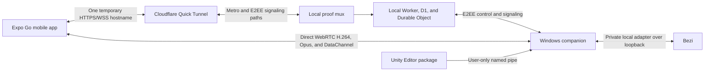

# Architecture

## Product boundary

The mobile app has exactly two primary product modes, **Bezi** and **Unity**.
Pairing, host selection, and Settings are secondary flows. The local protocol
used by the companion to drive Bezi is hidden behind the Bezi-mode adapter.

## Stage A trust boundary

The mobile app and Windows companion are the endpoints of the application
encryption boundary. A local signaling service authenticates the single proof
owner and routes opaque encrypted frames. A zero-login Cloudflare Quick Tunnel
exposes that service and Expo Metro under one temporary hostname. Cloudflare
receives no plaintext prompts, code, diffs, Unity values, or input payloads.

The Windows companion is the only process allowed to:

- read Bezi's local connection descriptor;
- connect to Bezi over loopback;
- accept the user-restricted Unity named-pipe connection;
- capture selected application windows; or
- inject input after a controller lease and local safety checks succeed.

## Components

The proof uses `stun.cloudflare.com` for credential-free ICE discovery. TURN
and a remotely deployed relay remain production hardening options, not Stage A
launch requirements.

The video renderer is an interface. Expo Go uses an inline WebView; the
production development build can replace it with native WebRTC without changing
product screens, signaling contracts, or encryption.

## Versioning

All wire messages carry protocol version `1`. Unsupported major versions are
rejected. Capability negotiation controls Bezi mode, Unity mode, streaming, and
input independently. Mutations use request IDs and idempotency keys; Unity
writes also carry an expected revision.

## Safety invariants

- One controller lease per host.
- Remote input starts disarmed.
- Background, disconnect, lease loss, idle timeout, and Windows lock release
  every held input.
- Persistent Unity assets cannot be edited in Play Mode.
- Scene changes are marked dirty and never silently saved.
- Unsupported operations fall back to selected-window remote view.
